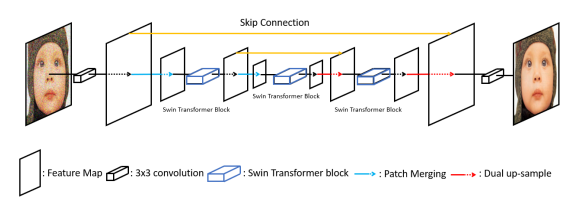

# 📘 SUNet: Swin Transformer + UNet for Image Denoising  
**Afeefa Muskan Shaik**

[](https://pytorch.org/)

---

## 🔍 Overview

This repository provides a **resource-efficient implementation** of **SUNet**, a hybrid architecture combining the **Swin Transformer** and **UNet** for high-fidelity image denoising.

The original SUNet was introduced by:

> **Chi-Mao Fan, Tsung-Jung Liu, Kuan-Hsien Liu**  
> *SUNet: Swin Transformer UNet for Image Denoising*  
> [[Paper Link]](https://arxiv.org/abs/2103.14030)

This implementation adapts SUNet for **consumer GPUs** (RTX 3050 16GB) by reducing parameters and training cost while maintaining strong denoising quality.

---

## ✨ Key Contributions (Adapted Version)

### Architecture Modifications
- Reduced **embedding dimension**: 96 → **64**
- Shallower Swin Transformer depths: **[2, 2, 2, 2]**
- Added **Dual Upsampling** (Bilinear + PixelShuffle)
- Fully PyTorch-based implementation

### Data Pipeline
- 10 random patches (256×256) per image  
- AWGN noise added (σ = **5 → 50**)  
- Training/validation aligned with DIV2K

### GPU-Friendly Training
- NVIDIA **RTX 3050 (16GB)**
- Batch size = **2**
- 200 epochs
- Mixed-noise evaluation σ = **10, 30, 50**

---

## 🧱 Model Architecture



Components:
- 3×3 Shallow Feature Extraction
- Swin Transformer–based UNet encoder/decoder
- Skip connections
- Dual up-sample module
- 3×3 reconstruction head

---

## 📦 Installation

```bash
git clone https://github.com/Afeefa165/SUNet.git
cd SUNet
pip install -r requirements.txt
```

---

## 📥 Dataset Preparation

### Download DIV2K (Kaggle)

```bash
pip install kaggle
kaggle datasets download -d shasur/dvd2k-image-denoising-dataset
```

**Alternative dataset:** [DIV2K High Resolution Images](https://www.kaggle.com/datasets/soumikrakshit/div2k-high-resolution-images)

### Preprocessing Steps
- Extract DIV2K HR images
- Generate 10× 256×256 random patches per image
- Add AWGN (σ = 5 → 50)
- Split into train/val

---

## 🚀 Training

```bash
python train.py
```

---

## 📊 Results (Adapted SUNet)

| Dataset | PSNR (dB) | SSIM | Params |
|---------|-----------|------|--------|
| DIV2K (mixed σ=10/30/50) | 32.826 | 0.8782 | ~15M |

**Notes:**
- Params reduced from 99M → 15M (85% reduction)
- Competitive results on CBSD68 + Kodak24
- Strong structural preservation even under heavy noise

---

## 📌 Citation (Original SUNet Paper)

### In-text (Overleaf)

```latex
SUNet was originally proposed by Fan et al. \cite{fan2021sunet}.
```

### BibTeX

```bibtex
@article{fan2021sunet,
  title={SUNet: Swin Transformer UNet for Image Denoising},
  author={Fan, Chi-Mao and Liu, Tsung-Jung and Liu, Kuan-Hsien},
  year={2021},
  journal={arXiv preprint arXiv:2103.14030}
}
```

---

## 🧩 Acknowledgements

This repo is an adapted implementation of the SUNet architecture proposed by Chi-Mao Fan, Tsung-Jung Liu, Kuan-Hsien Liu.

**Paper available here:** [SUNet on arXiv](https://arxiv.org/abs/2103.14030)

---


## 🤝 Contributing

Contributions, issues, and feature requests are welcome! Feel free to check [issues page](https://github.com/Afeefa165/SUNet/issues).

---

## 📧 Contact

**Afeefa Muskan Shaik**  
- GitHub: [@Afeefa165](https://github.com/Afeefa165)
- Email: afeefahh165@gmail.com

---

⭐ **If you find this project useful, please consider giving it a star!** ⭐
